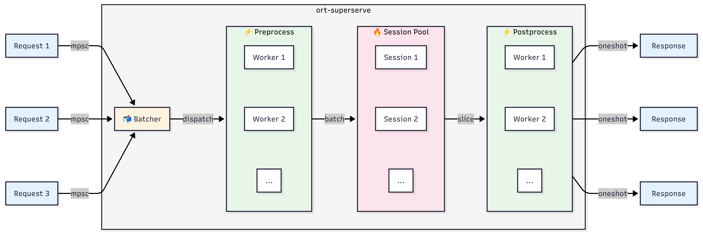

# ort-superserve

A "thin" asynchronous ONNX Runtime session orchestrator for high-throughput model serving. Designed for simplicity, flexibility, and performance.

Orchestrates a pool of ONNX sessions with dynamic batching and parallel processing, enabling thousands of concurrent requests to share the same model without mutex contention on the hot path.

## Architecture



## Features

- **Lock-free**: Unlike the naive approach of wrapping an ONNX session in `Arc<Mutex<Session>>` which creates a bottleneck under load, ort-superserve uses an actor model where requests flow through channels instead of locks, and a session pool where multiple ONNX sessions run in parallel on dedicated threads—zero mutex on the hot path.

- **Dynamic batching**: Incoming requests are collected into batches before being sent to inference. The batcher waits until either `max_batch_size` is reached or `max_wait_time` elapses, ensuring optimal GPU/CPU utilization. Without batching, each request would incur the full overhead of model invocation, resulting in poor throughput.

- **Built on [`ort`] crate**: Uses the mature ONNX Runtime bindings directly, supporting all execution providers that ONNX Runtime offers: CPU (default), CUDA, TensorRT, XNNPACK, and CoreML. This means you can deploy the same model on different hardware accelerators without code changes.

[`ort`]: https://crates.io/crates/ort

- **Works with all input/output types**: The `Input` and `Output` traits let you define custom preprocessing and postprocessing logic for any data type—images, text, audio, video, or complex structs. You implement `preprocess`, `batch`, and `postprocess`; the library handles the orchestration.

- **Session pool**: On multi-core servers, scaling a single ONNX session with more threads hits diminishing returns due to lock contention and memory bandwidth limits. A session pool runs multiple independent sessions in parallel, each with fewer threads, achieving near-linear scaling with core count. This is essential for high-throughput serving on modern hardware.

- **Parallel pre/post-processing**: Preprocessing and postprocessing run concurrently using `JoinSet`, pipelining CPU work while the GPU handles inference. This overlaps computation and hides latency, keeping the inference pipeline fully utilized.

## Installation

```toml
[dependencies]
ort-superserve = "0.1"

[features]
cuda = ["ort-superserve/cuda"]
tensorrt = ["ort-superserve/tensorrt"]
xnnpack = ["ort-superserve/xnnpack"]
coreml = ["ort-superserve/coreml"]
```

## Quick Start

```rust
use anyhow::Result;
use ndarray::{ArrayD, ArrayViewD, Array3, Axis};
use ort_superserve::{Input, Output, Server, ServerConfig};

// 1. Define your input type
struct ImageInput {
    data: Array3<f32>,
}

impl Input for ImageInput {
    type Preprocessed = Array3<f32>;

    async fn preprocess(self) -> Result<Self::Preprocessed> {
        // Your preprocessing logic (runs in parallel)
        Ok(self.data)
    }

    fn batch(items: Vec<Self::Preprocessed>) -> Result<ArrayD<f32>> {
        // Stack multiple preprocessed inputs into a batch
        let views: Vec<_> = items.iter().map(|a| a.view()).collect();
        Ok(ndarray::stack(Axis(0), &views)?.into_dyn())
    }
}

// 2. Define your output type
struct DetectionOutput {
    scores: Vec<f32>,
}

impl Output for DetectionOutput {
    async fn postprocess(raw: ArrayViewD<'_, f32>) -> Result<Self> {
        // Your postprocessing logic (runs in parallel)
        Ok(DetectionOutput {
            scores: raw.iter().cloned().collect(),
        })
    }
}

// 3. Create server and run inference
#[tokio::main]
async fn main() -> Result<()> {
    let config = ServerConfig::new()
        .with_num_sessions(4)
        .with_threads_per_session(2)
        .with_max_batch_size(16);

    let server = Server::<ImageInput, DetectionOutput>::from_file("model.onnx", config).await?;

    let output = server.infer(ImageInput { data: Array3::zeros((3, 224, 224)) }).await?;
    
    server.shutdown();
    Ok(())
}
```

## Configuration

```rust
use ort_superserve::{ServerConfig, ExecutionProvider};
use std::time::Duration;

let config = ServerConfig::new()
    .with_num_sessions(4)                              // Number of ONNX sessions in the pool
    .with_threads_per_session(2)                       // Threads per session
    .with_max_batch_size(16)                           // Maximum batch size
    .with_min_batch_size(1)                            // Minimum batch size
    .with_max_wait_time(Duration::from_millis(10))     // Max wait for batching
    .with_execution_provider(ExecutionProvider::Cpu);  // CPU execution (default)
```

## Loading Models

```rust
// From file
let server = Server::<MyInput, MyOutput>::from_file("model.onnx", config).await?;

// From URL
let server = Server::<MyInput, MyOutput>::from_url("https://example.com/model.onnx", config).await?;
```

## Axum Integration

Share the server across all HTTP handlers using `Arc`:

```rust
use std::sync::Arc;
use axum::{Router, routing::post, Json, extract::State};

async fn infer_handler(
    State(server): State<Arc<Server<MyInput, MyOutput>>>,
    Json(input): Json<MyInput>,
) -> Json<MyOutput> {
    Json(server.infer(input).await.unwrap())
}

#[tokio::main]
async fn main() -> anyhow::Result<()> {
    let server = Arc::new(Server::from_file("model.onnx", config).await?);
    
    let app = Router::new()
        .route("/infer", post(infer_handler))
        .with_state(server);

    let listener = tokio::net::TcpListener::bind("0.0.0.0:3000").await?;
    axum::serve(listener, app).await?;

    Ok(())
}
```

See `examples/axum_server.rs` for a complete example with graceful shutdown.

## License

MIT